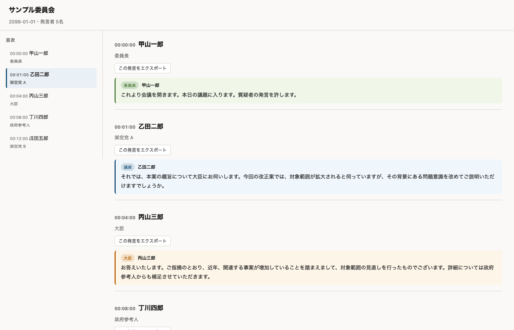

# kokkai-webtv-captions

国立国会図書館の [国会会議録検索システム](https://kokkai.ndl.go.jp/) に確定版の議事録 (全文テキスト) が載るのは、本会議で 1〜2 ヶ月ほど、委員会で 3〜5 週間ほどです (画像版はさらに 2〜3 ヶ月、分量等により前後する/[公式](https://kokkai.ndl.go.jp/help.html))。それまでの数十日間、議論を当日テキストで読みたかったので作りました。データソースは [参議院インターネット審議中継](https://www.webtv.sangiin.go.jp/) の AI 字幕と [衆議院インターネット審議中継](https://www.shugiintv.go.jp/) の音声 (こちらは手元で Whisper にかける) で、出力は発言者別 HTML と全文検索インデックス。あくまで未収録期間を埋める個人用途の補助ツールなので、正式な議事録は公式の国会会議録検索システムを参照してください。

[](https://www.python.org/)
[](LICENSE)
[]()
[]()
[]()



出力 HTML のサンプル。左に目次サイドバー、右に発言者カード (議員質問=青 / 大臣答弁=橙 / 政府参考人=灰 / 委員長=緑)。

agent には `--json` で 1 行 JSON を返します。発言テキスト本体は同梱せず、`files.text` / `files.vtt` / `files.transcript` のパスだけ含めるので、後段で必要なものだけ読めばいい。

```jsonc
// --json (compact、既定): 識別情報 + speakers + 出力ファイルパス
$ kkcap sangiin 8955 --json
{
  "ok": true,
  "files": {"html":"out/....html", "text":"out/....txt", "vtt":"out/....vtt"},
  "date": "2026-05-15",
  "title": "内閣委員会",
  "speakers": [
    {"start": 1852.6, "name": "...", "group": "委員長"},
    {"start": 1917.2, "name": "...", "group": "自由民主党・無所属の会"},
    ...
  ]
}

// --json-full: 上記 + 内部 meta (caption_url / player_url 等の実装詳細も)
$ kkcap sangiin 8955 --json-full

// --jsonl: meta / 各 speaker / result を 1 行ずつストリーム
$ kkcap sangiin 8955 --jsonl
{"type":"meta","date":"2026-05-15","title":"内閣委員会"}
{"type":"speaker","i":0,"start":1852.6,"name":"...","group":"委員長"}
...
{"type":"result","ok":true,"files":{...}}

// 失敗時 (どのモードでも 1 行で返る)
{"ok":false,"error":"FetchError","code":2,"message":"..."}
```

`--json*` 系を付けると stderr の進捗ログは止まる。`--resolve-only --json` はページ解決だけして meta を返す dry-run。

## できること

- `kkcap list` で両院の中継一覧、`kkcap search` で全文検索、`kkcap fetch` で複数 ID 一括取込 (院は ID 形式から自動判定)。sid / deli_id を覚えていなくても発見から取り込みまで通せる
- 院単位は `kkcap sangiin <sid>` / `kkcap shugiin <deli_id>`
- ASR も LLM 校正も全部手元で走る。API キー不要
- 出力 HTML は 1 ファイルで完結。Slack に放り込んだりメール添付しても壊れない
- 取得済の文字起こしは BM25 で全文検索。発言者・日付・委員会で絞れて、ヒット先には動画の該当時刻ジャンプ URL も付く。DB は持たず `out/` を毎回スキャン
- 衆議院 ASR の精度は辞書置換 (既定) → LLM 校正 (`--llm-correct`) → 2-pass (`--llm-context`) と段階的に上げられる
- `--json --quiet` で agent 用の 1 行 JSON、`--resolve-only` で取得前の dry-run

## 必要環境と依存ライブラリ

### システム要件

- Python 3.10 以上
- 衆議院 ASR を使う場合: [`ffmpeg`](https://ffmpeg.org/) (`brew install ffmpeg` / `apt install ffmpeg`) + Whisper モデル (turbo で約 1.5GB の初回 DL、`~/.cache/huggingface/` にキャッシュ) + 実行時 3〜4GB のメモリ
- LLM 校正 (`--llm-correct` / `--llm-context`) を使う場合: ローカル LLM 実行環境。`mlx` backend なら Apple Silicon Mac + Qwen3.5-9B 4bit (約 5.5GB DL、実行時 ~7GB のメモリ)、`openai` backend なら vllm-mlx / Ollama / LM Studio など OpenAI 互換 API を別途起動
- Apple Silicon Mac (任意、ただし強く推奨): ASR・LLM 校正とも MLX backend が速い

### 使用ライブラリ

| 用途 | パッケージ | 備考 |
|---|---|---|
| 形態素解析 (sangiin の発言者検出) | `sudachipy` + `sudachidict_core` | コア依存。辞書 ~80MB |
| ASR (`--asr`、`faster` backend) | `faster-whisper` | CTranslate2 ベース。Mac/Linux 共通 |
| ASR (`--asr-backend mlx`) | `mlx-whisper` (subprocess) | Apple Silicon ネイティブ、高速 |
| LLM 校正 (`--llm-backend mlx`) | `mlx-lm` + `outlines[mlxlm]` + `pydantic` | grammar-constrained 出力 |
| LLM 校正 (`--llm-backend openai`) | (標準 `urllib` のみ) | vllm-mlx / Ollama 等の OpenAI 互換 HTTP |
| 音声処理 | `ffmpeg` (システムバイナリ) | `brew install ffmpeg` |

### Whisper モデル (`--asr`)

faster-whisper か mlx-whisper が HuggingFace から `~/.cache/huggingface/` に自動 DL します。対話 TTY なら初回 DL 前に Y/N を聞きます。パイプや agent から呼ばれているときは黙って DL します。

| `--model` | ファイル DL サイズ | 実行時メモリ目安 (CPU/Metal) |
|---|---|---|
| `tiny` | ~80 MB | ~1 GB |
| `base` | ~150 MB | ~1 GB |
| `small` | ~500 MB | ~2 GB |
| `medium` | ~1.5 GB | ~3 GB |
| `turbo` (既定) | ~1.5 GB | ~3 GB |
| `large-v3` | ~3 GB | ~6 GB |

### LLM モデル (`--llm-correct` / `--llm-context`)

LLM 校正を使うときだけ必要。デフォルトは `mlx` backend で `mlx-community/Qwen3.5-9B-MLX-4bit` (Apple Silicon ローカル)。

| backend | デフォルトモデル | DL サイズ | 実行時メモリ目安 |
|---|---|---|---|
| `mlx` (既定) | `mlx-community/Qwen3.5-9B-MLX-4bit` | ~5.5 GB | ~7 GB (16GB RAM 機推奨) |
| `openai` | サーバ起動時に指定 | (サーバ側) | (サーバ側) |

### ディスク・処理時間の目安

M2 Mac で 3 時間の衆議院委員会を `--model turbo` で文字起こしする場合:

- wav: 約 350 MB (16kHz mono PCM、後で消して良い)
- transcript.json: 200〜500 KB
- HTML: 50〜200 KB
- メモリ: 3〜4 GB
- 所要時間: Whisper だけで 30〜60 分。`--llm-correct` を付けると +5〜15 分

非力なマシンなら `--model tiny` / `--model base` で。一度文字起こしした結果は `transcript.json` から `--skip-asr` で再利用できるので、強い機で ASR → 弱い機で HTML 再生成、という分業も可能。

## インストール

```bash
git clone https://github.com/rtoki/kokkai-webtv-captions.git
cd kokkai-webtv-captions
uv sync                       # 参議院モードのみ
uv sync --extra shugiin-asr   # 衆議院 ASR も使う場合 (要 ffmpeg)
brew install ffmpeg           # macOS / Linux は apt install ffmpeg
```

[uv](https://docs.astral.sh/uv/) を推奨します。<details><summary>pip / pipx / uv tool での代替手順</summary>

```bash
pip install -e ".[shugiin-asr]"
pipx install "git+https://github.com/rtoki/kokkai-webtv-captions.git"
uv tool install --editable ".[shugiin-asr]"
```
</details>

## クイックスタート

参議院は字幕を取ってきて整形するだけなので数秒:

```bash
uv run kkcap sangiin 8955
```

`out/{日付}_{会議名}_参{sid}.html` がブラウザで自動オープンします。`sid` は [webtv.sangiin.go.jp](https://www.webtv.sangiin.go.jp/) の再生ページ URL の `?sid=NNNN` から拾ってください。AI 字幕が付くのは 2024 年 8 月以降の中継のみ。

衆議院は ASR が走ります (既定で有効):

```bash
uv run kkcap shugiin 56246              # ASR で字幕付き HTML を生成
uv run kkcap shugiin 56246 --no-asr     # タイムラインだけ (Phase 2)
```

`deli_id` は [shugiintv.go.jp](https://www.shugiintv.go.jp/) の再生ページ URL の `?...deli_id=NNNNN` から。初回は Whisper turbo (約 1.5GB) が自動 DL されます。3 時間音声で 30〜60 分。最初は本会議など 10〜30 分の会議で試すのがおすすめ。`--model tiny` なら 5〜10 分で終わります (精度はその分落ちる)。

## 使い方

```bash
# 中継一覧 (sid/deli_id を知らなくてもここから入る)
kkcap list                       # 直近 7 日の両院
kkcap list --date 2026-05-14
kkcap list --only-new            # まだ取り込んでいないもの

# キーワード検索 + 未取込の関連会議を提案
kkcap search "MCP" --suggest

# 複数 ID を一括取込 (sangiin sid / shugiin deli_id 混在 OK)
kkcap fetch 8955 56239 56241 --skip-if-done

# 日付範囲で両院まとめて取込
kkcap fetch --from 2026-04-20 --to 2026-04-25 --skip-if-done
kkcap fetch --from 2026-04-20 --to 2026-04-25 --house shugiin --dry-run

# 院単位で叩く
kkcap sangiin 8955 --no-open
kkcap sangiin 8955 8956 8957 --skip-if-done
kkcap shugiin 56239 56241 --asr-backend mlx --skip-if-done
kkcap shugiin 56246                          # ASR は既定で有効、辞書校正もそのまま走る
kkcap shugiin 56246 --skip-asr               # 既存 transcript.json から HTML だけ再生成

# 取得済の文字起こしを全文検索
kkcap search "成年後見"
kkcap search "サイバー" --house sangiin --since 2026-04-01
kkcap search "答弁" --speaker 山田 --committee 法務 --json

# agent から呼ぶ用
kkcap sangiin 8955 --json --quiet
kkcap shugiin 56246 --json --quiet
kkcap sangiin 8955 --resolve-only --json     # 取得せず meta だけ
```

### 検索 (`kkcap search`)

`out/*.vtt` と `out/*_transcript.json` を毎クエリ読み込んで BM25 でランキング。DB は持たない。

```bash
kkcap search "成年後見"                       # シンプル検索
kkcap search '"事理弁識"'                     # フレーズ完全一致
kkcap search "成年後見 制度" --topk 20        # 上位 20 件
kkcap search "..." --since 2026-04-01 --until 2026-05-31
kkcap search "..." --speaker 山田             # 発言者名の部分一致
kkcap search "..." --committee 法務           # 会議名の部分一致
kkcap search "..." --house sangiin            # 参議院のみ
kkcap search "..." --json                     # エージェント用 1 行 JSON
kkcap search "..." --jsonl                    # 結果を 1 行ずつストリーム
```

ヒットには公式ネット中継ページの動画ジャンプ URL が付きます。35 日以上経過したヒットには [国会会議録検索](https://kokkai.ndl.go.jp/) (確定版) へのリンクも併記します。

#### トークン化キャッシュ

SudachiPy のトークン化結果は `out/.kokkai-search-cache.json` に保存され、2 回目以降の検索は約 8 倍速い (15K cue で 1.0s → 0.13s 程度)。ソース (`*.vtt` / `*_transcript.json`) の `mtime` が変わったぶんだけ再計算します。

```bash
kkcap search "..." --no-cache            # 今回だけキャッシュを使わない
kkcap search "..." --rebuild-cache       # キャッシュを再構築
rm out/.kokkai-search-cache.json           # 完全削除 (次回再構築)
```

キャッシュは gitignore 対象。`out/` を消せば一緒に消えます。

この検索が役に立つのは、ネット中継は公開済みだが国会会議録にまだ収録されていない 60 日程度の窓。それ以降の確定版は [国立国会図書館 国会会議録検索システム](https://kokkai.ndl.go.jp/) を参照してください。網羅性・精度ともに公式の確定版が正です。

### 精度向上オプション

衆議院 ASR の精度は段階的に上げられます。下に行くほど効果は大きいが、セットアップコストも上がります。preclean は常に有効で設定不要。

0. **preclean** (常時有効): Whisper の典型的な失敗 (YouTube 終了テロップ系幻覚、degenerate loop) を自動除去。下の「動作の仕組み」を参照

1. **辞書置換** (既定で有効): 議会音声で頻出する誤変換 (法律用語・議事手続き語) を決め打ちで置換

   ```bash
   kkcap shugiin 56246 --glossary my_glossary.txt   # ユーザ辞書を追加
   kkcap shugiin 56246 --no-glossary                # 比較検証用に切る
   ```

2. **LLM 校正** (`--llm-correct`): 文脈依存の誤認識をローカル LLM で直す。デフォルトは `mlx-community/Qwen3.5-9B-MLX-4bit` (5.5GB DL、7GB RAM)。約 600 cue の 1 会議で M2 Mac は +5〜15 分

   ```bash
   uv sync --extra llm-mlx
   kkcap shugiin 56246 --llm-correct
   kkcap shugiin 56246 --llm-correct --llm-backend openai  # vllm-mlx / Ollama
   ```

3. **2-pass ASR** (`--llm-context`): 1 回目の出力から固有名詞を LLM で抜き取り、ヒント文に追記して 2 回目を回す ([Whisper: Courtside Edition](https://arxiv.org/abs/2602.18966) のアプローチ)

   ```bash
   kkcap shugiin 56246 --llm-context --llm-correct  # 2-pass + 後段校正
   ```

どの段がどれくらい効いたかは HTML 冒頭の「AI パイプライン」行 (例: `ASR: mlx / turbo・hint 83字注入・preclean 幻覚 44 件・glossary 12 箇所・LLM 校正 103 箇所 (mlx)`) と meta.json `pipeline` セクションで確認できる。HTML 上部には `[衆議院]` / `[参議院]` のバッジも入る。

## 動作の仕組み

```
sangiin (参議院): sid → detail.php → HLS の WebVTT → SudachiPy 発言者検出 → HTML
shugiin (衆議院): deli_id → detail ページ → HLS → ffmpeg wav → Whisper + hint
                  → preclean (幻覚句 / degenerate loop 除去) → 発言者リストの時刻で振り分け
                  → 辞書校正 (+ LLM 校正) → HTML
```

衆議院は発言者と開始秒数をページ HTML が完全に持っているので、話者分離モデルは不要。

preclean は Whisper の典型的な失敗モードを自動で潰します:

- **YouTube 系幻覚句の除外**: 「ご視聴ありがとうございました」「チャンネル登録お願いします」等を含む cue を丸ごと捨てる。Whisper が YouTube 動画の終了テロップを大量学習しているため、無音や開会前 BGM でよく出てくる
- **degenerate loop の圧縮**: 1〜4 文字の音節が 10 連以上続くインライン loop (`...AIセーフティ・インシティティティティ...他社との...` のような壊れ方) を `[音声不明瞭]` 1 つに置換、前後の正常文は保持
- **cue 全体ループの置換**: テキスト全体が同一文字種で 200 字超のループ (`ティ` × 500 等) は cue ごと `[音声不明瞭]` に

除去件数は HTML ヘッダの「AI パイプライン」行と meta.json の `pipeline.preclean_hallucinations` / `preclean_loops` に残ります。

### ディレクトリ構成

```
kokkai/
├── __main__.py                統合 CLI ディスパッチャ (`kkcap <sub>`)
├── errors.py                  共通例外型
├── sangiin/                   参議院モード (WebVTT パイプライン)
│   ├── extract.py / detect.py / render.py / __main__.py
├── shugiin/                   衆議院モード (HTML パース + 任意 ASR)
│   ├── extract.py / render.py / __main__.py
│   ├── audio.py               ffmpeg HLS → wav
│   ├── members.py / hints.py  議員名簿 + initial_prompt 構築
│   ├── asr.py                 faster-whisper / mlx-whisper backend
│   ├── glossary.py            議会用語 静的「誤→正」置換
│   ├── llm_context.py         2-pass: LLM で固有名詞抽出
│   └── llm_correct.py         ASR 後段 LLM 校正 (mlx/openai)
├── search/                    BM25 全文検索 (DB なし、out/ を毎クエリスキャン)
│   ├── index.py               out/*.meta.json + vtt/transcript.json を cue 単位レコード化
│   ├── tokenize.py            SudachiPy ベースの形態素トークナイザ
│   ├── query.py               自前 BM25 ランキング + 日付/発言者/委員会フィルタ
│   ├── cache.py               トークン化結果の JSON キャッシュ (mtime 自動無効化)
│   ├── render.py              human / json / jsonl 出力
│   └── __main__.py            CLI: `kkcap search ...`
├── list/                      両院の中継一覧取得 (発見系)
│   ├── sangiin_list.py        参議院 webtv (calendar.php を月単位で取得)
│   ├── shugiin_list.py        衆議院 shugiintv (日別 ?u_day=YYYYMMDD)
│   ├── status.py              out/*.meta.json から取込済を判定
│   ├── render.py              human / json / jsonl 出力
│   └── __main__.py            CLI: `kkcap list ...`
└── fetch.py                   ID 形式から院を自動判定して sangiin/shugiin に dispatch
```

### 出力ファイル

`out/` (`-o` で変更可) に出力されます:

- sangiin: `{日付}_{会議名}_参{sid}.vtt` / `.txt` / `.html` / `.meta.json`
- shugiin: `{日付}_{会議名}_衆{deli_id}.html` / `_asr.html` / `_transcript.json` / `.wav` / `.meta.json`

院識別子は `_衆` / `_参` の漢字 1 字。旧形式 (`_deli{id}` や ID 無しの sangiin) も `kkcap search` 側で後方互換に拾う。

`{base}.meta.json` は `kkcap search` の一次ソース。発言者リスト・ファイルパス・公式ページ URL に加えて、`pipeline` セクション (asr_backend / asr_model / hint_chars / preclean_hallucinations / preclean_loops / llm_correct / glossary_changes / llm_correct_changes 等) を持つ。HTML ヘッダの「AI パイプライン」行はこの dict をそのまま出している。

## CLI リファレンス

<details>
<summary><code>kkcap sangiin &lt;sid&gt;</code></summary>

| option | 説明 |
|---|---|
| `-o, --output` | 出力ディレクトリ (既定 `./out`) |
| `--no-open` | 生成後にブラウザを開かない |
| `--redownload` | VTT キャッシュを無視して再ダウンロード |
| `--skip-if-done` | 既に取り込み済み (meta.json + .html 揃い) ならスキップ |
| `--resolve-only` | ページ解決と meta だけ返す (dry-run) |
| `--json` | 完了時に 1 行 JSON (compact: files + speakers + 識別情報) |
| `--json-full` | --json と同じだが、caption_url / player_url 等の内部 meta も含めた full 形式 |
| `--jsonl` | meta / 各 speaker / 結果を 1 行ごとの JSONL ストリーム |
| `--quiet` | 進捗ログを抑制 |

</details>

<details>
<summary><code>kkcap shugiin &lt;deli_id&gt;</code></summary>

| option | 説明 |
|---|---|
| `-o, --output` | 出力ディレクトリ |
| `--no-open` | 生成後にブラウザを開かない |
| `--asr` / `--no-asr` | ASR で字幕付き HTML を生成 (既定で有効、要 `shugiin-asr` extras)。`--no-asr` で Phase 2 タイムラインのみ |
| `--asr-backend` | `faster` / `mlx`。省略時は Apple Silicon + `mlx_whisper` 利用可なら `mlx`、それ以外は `faster` を自動選択 |
| `--model` | Whisper モデル: `turbo` (既定) / `large-v3` / `medium` / `small` / `base` / `tiny` |
| `--no-hint` | ヒント文 (initial_prompt) 注入を切る |
| `--refresh-members` | 議員名簿キャッシュを強制更新 |
| `--redownload` | wav キャッシュを無視して HLS から再変換 |
| `--skip-asr` | ffmpeg / Whisper を skip し既存 transcript.json から再 render |
| `--skip-if-done` | 既に取り込み済み (meta.json + .html 揃い) ならスキップ |
| `--no-glossary` | デフォルトの議会用語辞書を無効化 |
| `--glossary <path>` | 追加辞書ファイル |
| `--llm-context` | 2-pass ASR: 1-pass の出力から LLM で固有名詞抽出 → 2-pass で注入 |
| `--llm-correct` | ASR 後段に LLM 校正 |
| `--llm-backend` | `mlx` (既定) / `openai` |
| `--llm-model` | モデル名 (backend ごとの既定あり) |
| `--json` / `--json-full` / `--jsonl` | エージェント向け出力 (sangiin と同じ意味) |
| `--quiet` | 進捗ログを抑制 |

</details>

<details>
<summary><code>kkcap list</code> (両院の中継一覧)</summary>

| option | 説明 |
|---|---|
| `--date YYYY-MM-DD` | 特定日のみ |
| `--since YYYY-MM-DD` | この日付以降 |
| `--until YYYY-MM-DD` | この日付以前 |
| `--house sangiin / shugiin` | 院フィルタ |
| `--committee <substr>` | 会議名の部分一致 |
| `--only-new` | 未取込のもののみ |
| `--only-fetched` | 取込済のもののみ |
| `--json` / `--jsonl` | エージェント向け出力 |

両院とも期間指定可。直近の中継一覧を取得します。

</details>

<details>
<summary><code>kkcap fetch &lt;id&gt; [&lt;id&gt;...]</code> (院自動判定で一括取込)</summary>

| option | 説明 |
|---|---|
| `--from YYYY-MM-DD` | この日付以降の中継を `kkcap list` 経由で列挙して fetch (`--to` 省略時は今日まで) |
| `--to YYYY-MM-DD` | この日付以前 (`--from` 省略時は 7 日前から) |
| `--house` | 日付列挙を `sangiin` / `shugiin` に絞る |
| `--dry-run` | fetch せず対象 ID を `<院>\t<id>[\t<日付 タイトル>]` で表示 (explicit target も `--from/--to` 列挙も両方) |
| `--asr` / `--no-asr` | 衆議院 ASR を実行 (既定で有効、要 `shugiin-asr` extras)。`--no-asr` で Phase 2 タイムラインのみ |
| `--skip-if-done` | 既に取込済ならスキップ |
| `--no-open` | 完了後にブラウザを開かない |
| `-o, --output` | 出力ディレクトリ |

ID は 30000 未満なら参議院 sid、30000 以上なら衆議院 deli_id と自動判定。URL 直接指定も OK。
日付指定は `YYYY-MM-DD` / `YYYY/MM/DD` / `YYYYMMDD` / `YYYY年M月D日` を受け付ける。

</details>

<details>
<summary><code>kkcap search &lt;query&gt;</code></summary>

| option | 説明 |
|---|---|
| `-o, --output` | 検索対象ディレクトリ (既定 `./out`) |
| `--topk` | 表示する上位件数 (既定 10) |
| `--since` | この日付以降 (例: `2026-05-01`) |
| `--until` | この日付以前 |
| `--speaker` | 発言者名の部分一致 |
| `--committee` | 会議名の部分一致 (例: `法務`) |
| `--house` | `sangiin` / `shugiin` で絞り込み |
| `--json` | 1 行 JSON で結果を stdout に |
| `--jsonl` | meta 1 行 + ヒット 1 行ずつの JSONL |
| `--no-cache` | トークン化キャッシュを使わず毎回再計算 |
| `--rebuild-cache` | 既存キャッシュを削除して再構築 |
| `--suggest` | 結果末尾に「未取込で議題名にクエリを含む会議」を提示 |
| `--suggest-days N` | 未取込候補を探す直近日数 (既定 14) |

クエリ構文: スペース区切り = AND、`"..."` で囲むとフレーズ完全一致。

</details>

<details>
<summary>Optional extras</summary>

| extras | 用途 |
|---|---|
| `shugiin-asr` | 衆議院 ASR (`faster-whisper`)。ffmpeg 別途必須 |
| `shugiin-asr-mlx` | MLX Whisper backend (Apple Silicon、高速) |
| `llm-mlx` | LLM のローカル backend (`outlines[mlxlm]`、Apple Silicon) |
| `dev` | テスト (`pytest`) |

</details>

## 開発

```bash
uv run pytest tests/ -q     # ユニットテスト 200+ 件
```

テストはネット I/O や Whisper / LLM の実モデル呼び出しを含まない (そっちは E2E スモークで別に検証する)。

## トラブルシューティング

| 症状 | 対処 |
|---|---|
| `字幕トラックが見つかりません` (sangiin) | 2024 年 8 月より前の動画です。本ツールでは取得不可 |
| `sudachipy.errors.SudachiError: dictionary is not registered` | `uv sync` で再インストール |
| `Request Rejected` (HTTP) | サイト側のアクセス制限に該当しています。リクエスト頻度を下げて時間を置いてから、各院の利用条件の範囲内で再試行してください |
| `ModuleNotFoundError: No module named 'kokkai'` | `UV_LINK_MODE=copy uv sync --reinstall` (macOS uv 0.11 の `.pth` UF_HIDDEN 既知問題) |
| `ffmpeg が見つからない` | `brew install ffmpeg` / `apt install ffmpeg` |

## 免責事項

- 本ツールは作者が個人的な用途で作成・公開しているものです。動作・出力結果・利用に伴ういかなる損害についても、作者は一切の責任を負いません。
- 国会インターネット中継の映像・字幕および衆参両院ホームページの掲載情報には、それぞれの院・発言者・関係者の著作権が及びます。利用にあたっては各院の公式案内を参照し、著作権法および各院の利用条件の範囲内でご使用ください。
  - 参議院: [利用方法](https://www.webtv.sangiin.go.jp/webtv/howto.php)
  - 衆議院: [著作権・リンクについて](https://www.shugiintv.go.jp/jp/index.php?ex=CR)
- 本ツールは取得・整形をユーザーのローカル端末で行うのみで、サーバー上での再配信は行いません。
- ASR や LLM 校正の出力には誤認識・誤変換が含まれます。正式な記録としての利用は [国会会議録検索システム](https://kokkai.ndl.go.jp/) を参照です。

## ライセンス

MIT — [LICENSE](LICENSE) 参照。

## 謝辞

このツールは、国立国会図書館 (国会会議録検索システム)、参議院 (インターネット審議中継)、衆議院 (インターネット審議中継) が議事録・中継を公開してくださっているおかげで成立しています。とくに参議院 webtv の AI 字幕 (2024 年 8 月開始) と、衆議院ネット中継ページが提供する発言者リスト + 開始秒数の構造化データを利用しています。

## 出典・参考リンク

- [国会会議録検索システム](https://kokkai.ndl.go.jp/) — 国立国会図書館
- [参議院インターネット審議中継](https://www.webtv.sangiin.go.jp/) / [利用方法](https://www.webtv.sangiin.go.jp/webtv/howto.php)
- [衆議院インターネット審議中継](https://www.shugiintv.go.jp/) / [著作権・リンクについて](https://www.shugiintv.go.jp/jp/index.php?ex=CR)
- [Whisper: Courtside Edition (2-pass with LLM-driven context)](https://arxiv.org/abs/2602.18966)
